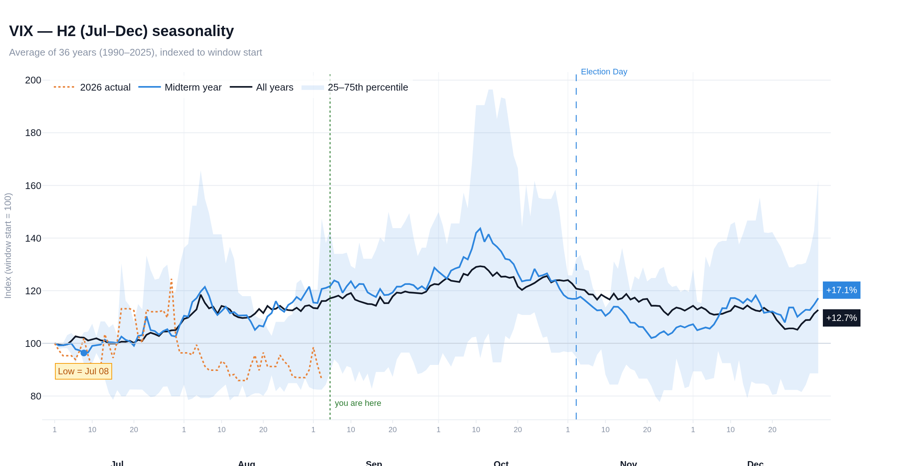

# Seasonality Explorer

Interactive seasonality charts for any asset Yahoo Finance covers — indices, ETFs,
sectors, futures, FX, crypto, single stocks. Pick an asset and a calendar window
(full year, half year, quarter, or any custom 3/6/12-month span), and the app
averages every year of history into one composite path, with an optional overlay
for a slice of the US election cycle (midterm years, election years, …).



## Install

```bash
cd SeasonlityTool
python3 -m venv .venv && source .venv/bin/activate
pip install -r requirements.txt
```

## Run

```bash
streamlit run app.py
```

It opens at http://localhost:8501.

## What the chart shows

Every year is sliced to the selected window, **indexed to 100 on the first trading
day of that window**, and aligned on a calendar-day grid (Jul 1, Jul 2, …) so the
x-axis reads as real dates. Weekends and holidays carry the previous close forward.
Feb 29 is dropped so leap years line up with everything else. The plotted lines are:

| Line | Meaning |
|---|---|
| **All years** (black) | Mean (or median) of every complete year in the selected range |
| **Cycle filter** (blue) | Same, restricted to one or more election-cycle phases — midterm years by default |
| **Percentile band** | 25th–75th percentile of the individual year paths (adjustable) |
| **Current year** (orange dotted) | The live year's actual path, stopping at the last real close |
| Faint grey lines | Optional: every individual year behind the composite |

Uncheck **Show all-years line** in the sidebar to chart the filtered years on their
own (`--only-filtered` on the CLI). With no cycle filter selected the all-years
line stays, since it would otherwise leave an empty chart.

Markers: the seasonal low of the highlighted composite, US Election Day (first
Tuesday after the first Monday in November), and a "you are here" line at today's
date.

The x-axis is two-tier: day-of-month ticks on top, month names on a row beneath
(1/5/10/15/20/25 for a quarter, 1/10/20 for a half year, month names alone for a
full year). Turn the day ticks off in the sidebar for month names only.

## Controls

- **Asset** — preset lists by category, or type any Yahoo ticker (`NVDA`, `BTC-USD`, `CL=F`, `^N225`).
- **Data source** — `Auto` (default), `Yahoo`, `FRED` or `CSV`. Auto puts the longest available history in front of Yahoo's current series and splices where they meet. The sidebar shows the source, series and coverage actually in use.
- **Window** — presets (Full year, H1, H2, Q1–Q4) or a custom start month + 3/6/12-month length. Windows may wrap the year end (e.g. Nov–Jan).
- **Years** — restrict the sample, e.g. post-1950 only.
- **Election-cycle filter** — midterm / election / post-election / pre-election years. Midterm = year mod 4 == 2 (2018, 2022, 2026…).
- **Average using** — mean or median across years.
- **Refresh price data** — force a fresh download (data is otherwise cached 12h).

## Tabs

- **Year detail** — per-year window return, max gain, max drawdown, plus a summary by cycle phase.
- **Monthly returns** — the classic month-by-year returns grid, heat-mapped.
- **Export** — CSV of the plotted curves, CSV of every year's path, and a standalone HTML copy of the chart.

## Command line

Same engine, no UI:

```bash
python export_chart.py ^GSPC --window H2 --phase "Midterm year" -o sp500_h2.html
python export_chart.py CL=F --start-month 3 --months 6 --years 1990:2025 -o crude.png
```

PNG export needs Chrome installed for kaleido (`plotly_get_chrome`); HTML export has no
extra requirement.

## As a library

```python
from seasonality import data, chart
from seasonality.engine import compute_seasonality

hist = data.load_history("^GSPC")
res = compute_seasonality(hist["close"], "^GSPC", start_month=7, n_months=6,
                          phases=["Midterm year"], band=(25, 75), current_year=2026)

print(res.stats_filtered.avg_return_pct, res.stats_filtered.low_date)
res.to_frame().to_csv("curves.csv")     # every plotted series by date
chart.build_figure(res).write_html("chart.html")
```

## Layout

```
app.py                  Streamlit UI
export_chart.py         CLI export
check_sources.py        report which source and history each asset resolves to
data/custom/            your own CSVs, spliced in front of Yahoo (see its README)
DEPLOY.md               free hosting options (Streamlit Cloud, Render, Cloud Run)
Dockerfile              container image for Render / Cloud Run / local docker
.streamlit/config.toml  theme + server defaults
seasonality/
  assets.py             preset ticker lists by category
  data.py               yfinance download + local parquet cache (data/cache/)
  engine.py             window slicing, indexing, alignment, cycle filters, stats
  chart.py              Plotly figure builder
tests/                  unit tests, no network  (python -m pytest tests -q)
```

## Hosting

`DEPLOY.md` covers the free options — Streamlit Community Cloud (simplest: push
to GitHub, point it at `app.py`), Render's free web service, and Google Cloud Run
via the included `Dockerfile`.

## Data & caveats

Prices are daily closes cached under `data/cache/`, one file per source. If a
download fails the app falls back to the cached copy. Years that don't cover the
window (a listing that starts mid-window, or the year in progress) are excluded
from the composites — the live year is drawn separately.

**Three sources, longest first.** Yahoo Finance covers everything and is
split/dividend adjusted, but its continuous futures series are short: `GC=F`
starts in 2000, and so does every other `=F` ticker, leaving five or six midterm
years to average. FRED (St. Louis Fed) publishes long daily benchmarks through a
documented CSV API — WTI from 1986, Brent from 1987, Henry Hub gas from 1997.
Anything you drop in `data/custom/` outranks both.

`Auto` takes Yahoo as the current series, finds the longest earlier one
available, and **splices** them: the older series is scaled by the median price
ratio over their overlap, then joined at the last common date. That is a level
shift only — every year's shape, which is all seasonality reads, is untouched —
and the sidebar shows the join date. Where the two are different instruments (the
London fix versus the front COMEX contract) the label says so.

**Your own CSVs** go in `data/custom/`, named for the ticker (`GC_F.csv` for
`GC=F`). One date column and one price column, any of the usual spellings, either
sort order; see `data/custom/README.md`. This is how gold and silver get their
pre-2000 history: FRED carried the LBMA fixings until they were discontinued *and
removed* (both ids now 404), and its remaining precious-metal series are monthly,
which cannot drive a daily path. Download the LBMA daily history once, drop it in,
and the app splices Yahoo onto the end. Hit **↻ Refresh price data** after adding
a file — the loader caches for six hours.

FRED has no daily history for copper, grains or softs either, so those stay at
Yahoo's 2000 start unless you supply a CSV. `python check_sources.py` prints what
each asset actually resolves to.

Stooq filled this role until it put its CSV endpoint behind a JavaScript
proof-of-work bot challenge, which no script can pass. That path was removed
rather than left broken.

Seasonal averages describe past tendencies with wide dispersion around them; the
percentile band and per-year table are there to make that dispersion visible. Not
investment advice.
